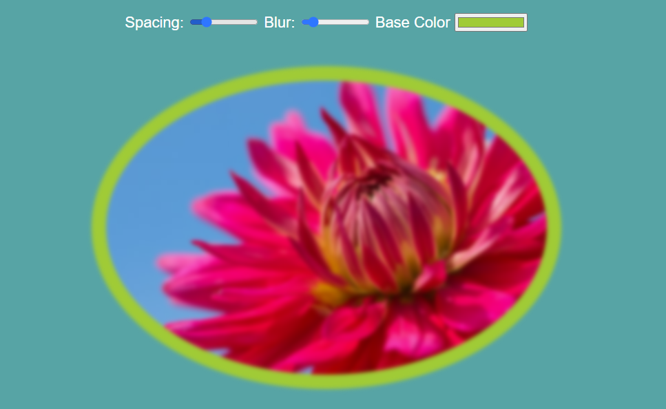

# variable-switch

CSS variables using JavaScript as a "switch" to adjust the example image's properties: padding, blur and padding color.

To see the live demo, click [here](https://lillapulay.github.io/variable-switch/).

Background and favicon image by [Patrick Connor Klopf on Unsplash](https://unsplash.com/photos/AggM5Lcvtxo).
